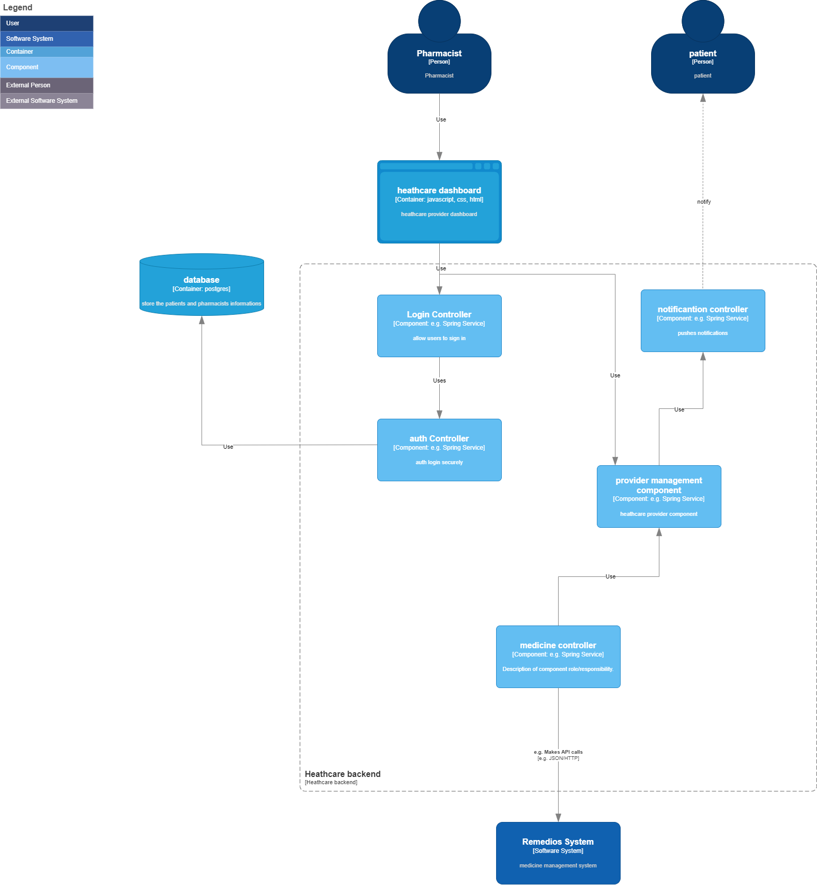
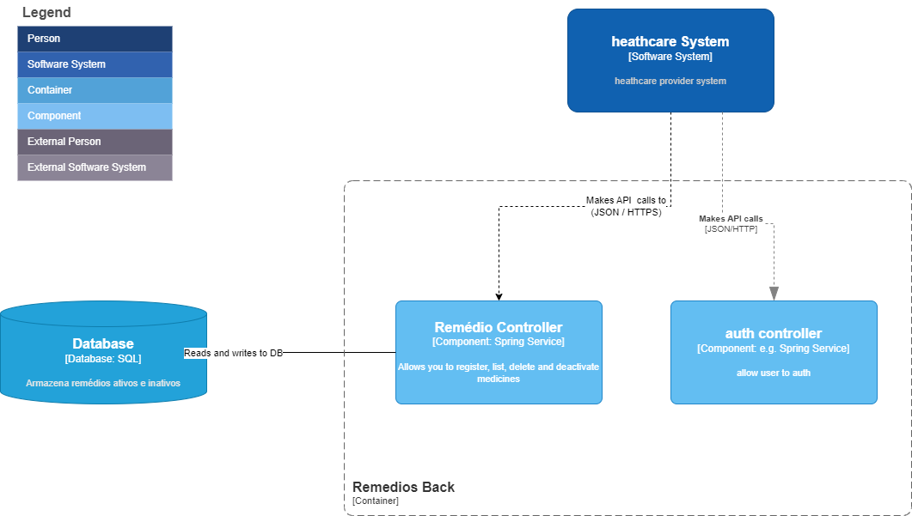

## 3. Diagrama de Componentes

### Objetivo

Detalhar a estrutura interna de um container, mostrando seus componentes principais.

### Passos

1. **Escolha um Container**: Selecione um container para detalhar.
2. **Identificar Componentes**: Liste os principais componentes desse container, como módulos, classes, ou serviços.
3. **Criar o Diagrama**: Desenhe um diagrama que mostre como os componentes interagem entre si dentro do container selecionado.

#### vamos olhar de perto como seria o diagrama de componentes do healthcare provider.

 

#### vamos olhar de perto agora como seria o diagrama de componentes do remedios back.

 